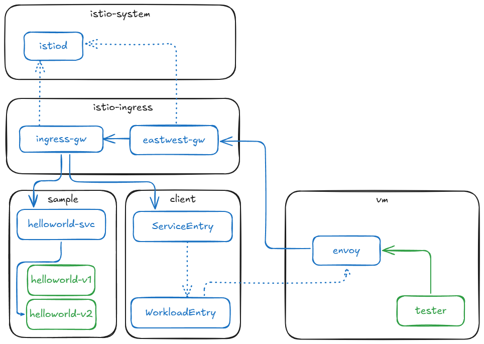

# service mesh

## components


## istio configs
- IstioOperator
```
apiVersion: install.istio.io/v1alpha1
kind: IstioOperator
metadata:
  name: istio
spec:
  values:
    global:
      meshID: [MESH_ID]
      multiCluster:
        clusterName: "[CLUSTER_ID]"
      network: "[NETWORK_ID]"
```
- WorkloadGroup
```
apiVersion: networking.istio.io/v1
kind: WorkloadGroup
metadata:
  name: "[NAME]"
  namespace: "[VM_NAMESPACE]"
spec:
  metadata:
    labels:
      app: "[NAME]"
  template:
    serviceAccount: "[VM_SERVICE_ACCOUNT]"
    network: "[NETWORK_ID]"
```
- WorkloadEntry
```
apiVersion: networking.istio.io/v1
kind: WorkloadEntry
metadata:
  name: "[VM_NAME]"
spec:
  address: [VM_IP]
  labels:
    app: "[NAME]"
```
- ServiceEntry
```
apiVersion: networking.istio.io/v1
kind: ServiceEntry
metadata:
  name: tester-svc
spec:
  hosts:
  - [MESH_DNS_HOST]
  location: MESH_INTERNAL
  ports:
  - number: 5000
    name: http
    protocol: HTTP
    targetPort: 5000
  resolution: DNS
  workloadSelector:
    labels:
      app: [VM_NAME]
```

## vm configs
- /etc/certs/root-cert.pem
- /var/run/secrets/tokens/istio-token
- /var/lib/istio/envoy/cluster.env
```
CANONICAL_REVISION='latest'
CANONICAL_SERVICE='[VM_NAME]'
ISTIO_INBOUND_PORTS='*'
ISTIO_LOCAL_EXCLUDE_PORTS='22,15090,15021,15020'
ISTIO_METAJSON_LABELS='{"app":"[VM_NAME]","service.istio.io/canonical-name":"[VM_NAME]","service.istio.io/canonical-revision":"latest"}'
ISTIO_META_CLUSTER_ID='[CLUSTER_ID]'
ISTIO_META_DNS_CAPTURE='true'
ISTIO_META_MESH_ID='[MESH_ID]'
ISTIO_META_NETWORK='[NETWORK_ID]'
ISTIO_META_WORKLOAD_NAME='[VM_NAME]'
ISTIO_NAMESPACE='[VM_NAME]'
ISTIO_SERVICE='[VM_NAME].[VM_NAMESPACE]'
ISTIO_SERVICE_CIDR='*'
POD_NAMESPACE='[VM_NAMESPACE]'
SERVICE_ACCOUNT='[VM_SERVICE_ACCOUNT]'
TRUST_DOMAIN='cluster.local'
```
- /etc/istio/config/mesh
```
defaultConfig:
  discoveryAddress: istiod.istio-system.svc:15012
  meshId: mesh1
  proxyMetadata:
    CANONICAL_REVISION: latest
    CANONICAL_SERVICE: [VM_NAME]
    ISTIO_META_CLUSTER_ID: [CLUSTER_ID]
    ISTIO_META_DNS_CAPTURE: "true"
    ISTIO_META_MESH_ID: [MESH_ID]
    ISTIO_META_NETWORK: [NETWORK_ID]
    ISTIO_META_WORKLOAD_NAME: [VM_NAME]
    ISTIO_METAJSON_LABELS: '{"app":"[VM_NAME]","service.istio.io/canonical-name":"[VM_NAME]","service.istio.io/canonical-revision":"latest"}'
    POD_NAMESPACE: [VM_NAMESPACE]
    SERVICE_ACCOUNT: [VM_SERVICE_ACCOUNT]
    TRUST_DOMAIN: cluster.local
```
- /etc/hosts
```
[east-west-gateway-lb-ip]  istiod.istio-system.svc
```