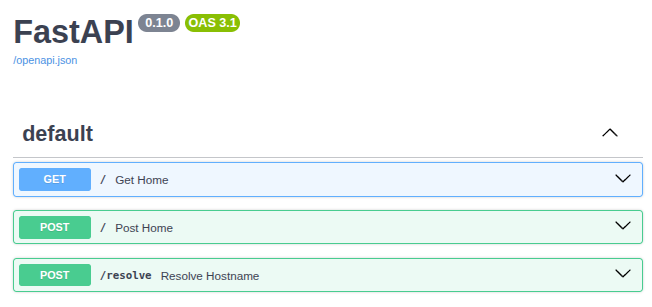

# http tester for service mesh
A simple web ui to run http get und nslookup request inside of the cluster.
Perfect to check availability of services, dns entries and hostnames from a pod point of view.
Used to test Istio Gateway, from Ingress to Eastwest service meshes.

## subprojects
* /diagrams - ISTIO service mesh and gateway diagrams
* /egress - short howto for ISTIO egress gateways
* /istio-vm-service - short howto for ISTIO VM integration
* /k3s-airgap - short howto for k3s airgap install
* /kind - a simple script based, step by step setup, for dual kind clusters with metallb to create a Istio based service mesh based on vips.

And the build steps for the http tester itself:
## get uv - makes python life easier
```
curl -LsSf https://astral.sh/uv/install.sh | sh
```

## run
```
uv sync
.venv/bin/uvicorn server:app --reload --host 0.0.0.0 --port 5000
```

### from scratch
- cd httptester
- uv sync
- uv pip compile pyproject.toml -o requirements.txt
- uv pip install -r requirements.txt
- uv run server.py

## build
```
docker build -t http-tester .
```

## run local
```
docker run -p 5000:5000 http-tester
```

## publish
```
docker login
docker tag http-tester wlanboy/http-tester:latest
docker push wlanboy/http-tester:latest
```

## run as daemon
```
docker run -d -p 5000:5000 wlanboy/http-tester
```

## deploy
```
kubectl create namespace demo
kubectl label namespace demo istio-injection=enabled
kubectl create deployment tester --image=wlanboy/http-tester:latest -n demo
kubectl expose deployment tester --type=ClusterIP --port=5000 -n demo
kubectl set image deployment/tester 'wlanboy/http-tester:latest' -n demo
```

## test calls
- use swagger ui: http://localhost:5000/docs

