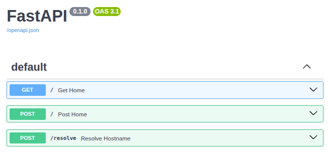

# http tester for service mesh

A simple web ui to run http get und nslookup request inside of the cluster.
Perfect to check availability of services, dns entries and hostnames from a pod point of view.

Der `http-tester` läuft als eigener Pod im Mesh und bietet drei Kernfunktionen:

* **GET-Requests absetzen** – beliebige URL vom Pod aus aufrufen und Response-Body sowie -Header sehen. Damit lässt sich prüfen, ob ein Service über Ingress-Gateway, Egress-Gateway oder East-West-Gateway erreichbar ist, ob mTLS/AuthorizationPolicies greifen und wie mesh-interne Antworten aussehen.
* **DNS-Auflösung** – Hostnamen per `nslookup`-Äquivalent aus Pod-Sicht auflösen, um Kubernetes-DNS, ServiceEntries und externe Namensauflösung (z. B. für Egress) zu verifizieren.
* **JSON-Echo** (`/postbody`) – zum Testen von Payload-Weiterleitung, Content-Type-Handling und Proxy-Verhalten (z. B. Header-Manipulation durch EnvoyFilter).

Da alles über eine einfache Web-UI und Swagger (`/docs`) bedienbar ist, braucht man
keinen eigenen `curl`/`dig` im Debug-Container – der Pod selbst ist das Werkzeug.
Typische Einsatzszenarien: Erreichbarkeit von Services vor/nach einem Rollout prüfen,
Istio Ingress-/Egress-/East-West-Gateways verifizieren, oder schnell aus einem
bestimmten Namespace heraus testen, ob eine Zielresource überhaupt sichtbar ist.

## get uv - makes python life easier

```bash
curl -LsSf https://astral.sh/uv/install.sh | sh
```

## run

```bash
uv sync
.venv/bin/uvicorn server:app --reload --host 0.0.0.0 --port 5000
```

## from scratch

```bash
cd httptester
uv sync
uv pip compile pyproject.toml -o requirements.txt
uv pip install -r requirements.txt
.venv/bin/uvicorn server:app --reload --host 0.0.0.0 --port 5000
```

## run behave tests

```bash
.venv/bin/behave features/httptester.feature
```

## lint & type check

```bash
uv run ruff check .
uv run pyright .
```

## endpoints

| Method | Path         | Beschreibung                                          |
|--------|--------------|--------------------------------------------------------|
| GET    | `/`          | HTML-Formular                                          |
| POST   | `/`          | Führt einen GET-Request gegen die angegebene `url` aus |
| POST   | `/resolve`   | Löst einen `hostname` per DNS auf                      |
| POST   | `/postbody`  | Echoed einen JSON-Body zurück (`message`, `value`)     |
| GET    | `/healthz`   | Liveness-/Readiness-Check, liefert `{"status": "ok"}`  |
| GET    | `/docs`      | Swagger UI                                             |

## build

```bash
docker build -t http-tester .
```

Das Image läuft als non-root User (`appuser`, uid 1000) und beendet sich bei
`SIGTERM` sauber über den FastAPI-Shutdown-Event (wichtig für schnelle
Rolling-Updates/Restarts in Kubernetes).

## run local

```bash
docker run -p 5000:5000 http-tester
```

## run as daemon

```bash
docker run -d -p 5000:5000 wlanboy/http-tester
```

## deploy

### kubectl (imperativ)

```bash
kubectl create namespace demo
kubectl label namespace demo istio-injection=enabled
kubectl create deployment tester --image=wlanboy/http-tester:latest -n demo
kubectl expose deployment tester --type=ClusterIP --port=5000 -n demo
kubectl set image deployment/tester 'wlanboy/http-tester:latest' -n demo
```

### Helm chart

Das Chart in [`tester-chart`](tester-chart) deployt zusätzlich `Service`,
Liveness-/Readiness-Probes auf `/healthz` sowie optional ein Istio
`Gateway`/`VirtualService`:

```bash
helm upgrade --install tester ./tester-chart \
  --namespace tester --create-namespace
```

Wichtige Werte in [`tester-chart/values.yaml`](tester-chart/values.yaml):

```yaml
namespace: tester
deploymentName: tester

image:
  repository: wlanboy/http-tester
  tag: latest

service:
  port: 5000
```

## test calls

Use swagger ui: http://localhost:5000/docs

